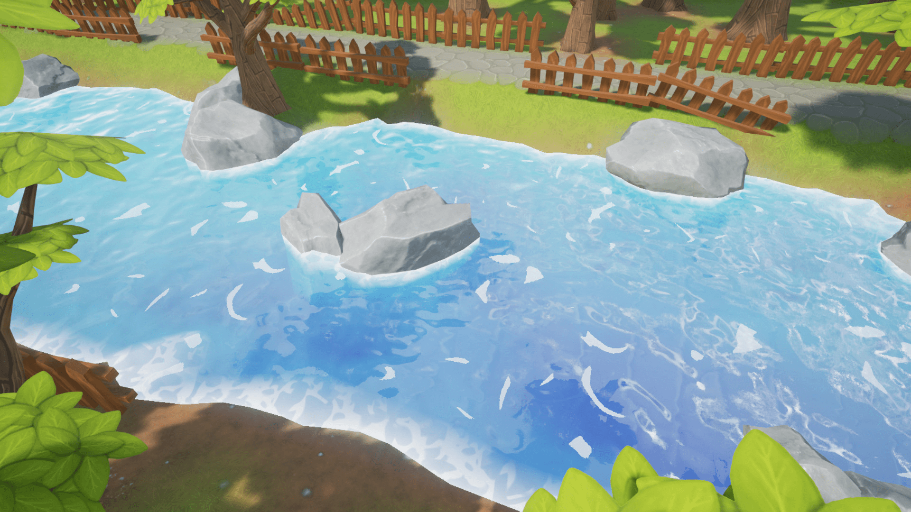

    </a>

# 🌌 StreamGen

A framework and implementation for simulating stream datasets.

    
    
    
    

    
    

    
    

---

## 📃 Table of Contents

- [💡 Idea](#💡-idea)
- [📦 Installation](#📦-installation)
- [👀 Examples](#👀-examples)
- [📖 Documentation](#📖-documentation)
- [🙏 Acknowledgement](#🙏-acknowledgement)

---

## 💡 Idea

## 📦 Installation

## 👀 Examples

## 📖 Documentation

## 🙏 Acknowledgement

Made with ❤️ and ☕ by Laurenz Farthofer.

Special thanks to Benjamin Steinwender, Marius Birkenbach and Nikolaus Neugebauer for their valuable feedback.

I want to thank Infineon and Kai for letting me work on and publish this project.

Finally, I want to thank my university supervisors Thomas Pock and Marc Masana for their guidance.
