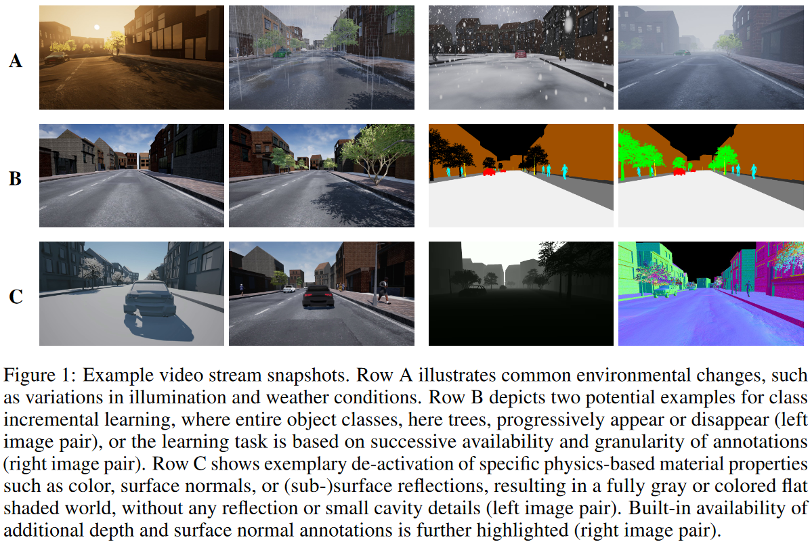
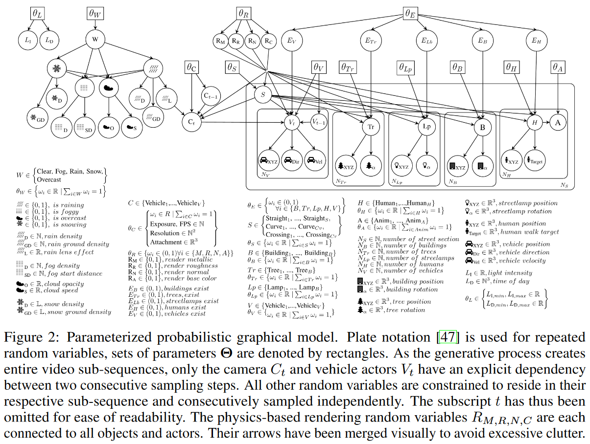
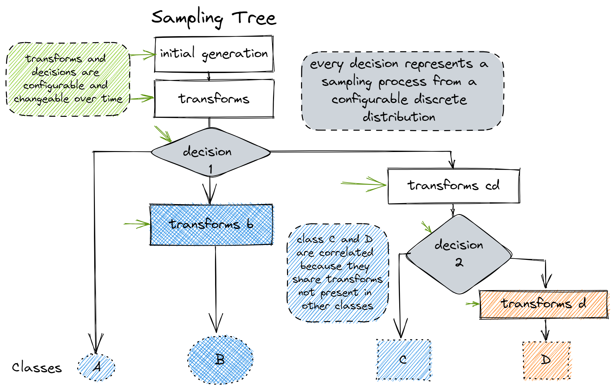

<p align="center">
    </a>
</p>

<h1 style="text-align: center;">
    
    StreamGen
</h1>

<p align="center">
a 🐍 framework for generating labeled data streams
</p>

<p align="center">
    
    <a href="https://www.repostatus.org/#wip"></a>
    
    
</p>

<p align="center">
    <a href="https://www.python.org/"></a>
    <a href="https://python-poetry.org/"></a>
</p>

<p align="center">
    <a href="https://github.com/astral-sh/ruff"></a>
    <a href="https://github.com/beartype/beartype"></a>
</p>

---

## 📃 Table of Contents

- [⚗️ Motivation](#⚗️-motivation)
- [💡 Idea](#💡-idea)
- [📦 Installation](#📦-installation)
- [👀 Examples](#👀-examples)
- [📖 Documentation](#📖-documentation)
- [🙏 Acknowledgement](#🙏-acknowledgement)

---

## ⚗️ Motivation

Most machine learning systems rely on *stationary, labeled, balanced and large-scale* datasets.
**Incremental learning** (IL), also referred to as **lifelong learning** (LL) or **continual learning** (CL), extends the traditional paradigm to work in dynamic and evolving environments.
This requires such systems to acquire and preserve knowledge continually.

Existing CL frameworks like [avalanche](https://github.com/ContinualAI/avalanche)[^1] or [continuum](https://github.com/Continvvm/continuum)[^2] construct data streams by *splitting* large datasets into multiple *experiences*, which has a few disadvantages:

- results in unrealistic scenarios
- offers limited insight into distributions and their evolution
- not extendable to scenarios with fewer constraints on the stream properties

To answer different research questions in the field of CL, researchers need knowledge and control over:

- class distributions
- novelties and outliers
- complexity and evolution of the background domain
- semantics of the unlabeled parts of a domain
- class dependencies
- class composition (for multi-label modelling)

A more economical alternative to collecting and labelling streams with desired properties is the **generation** of synthetic streams[^6].
Some mentionable efforts in that direction include augmentation based dataset generation like [ImageNet-C](https://github.com/hendrycks/robustness)[^3] or simulation-based approaches like the [EndlessCLSim](https://arxiv.org/abs/2106.02585)[^4], where semantically labeled street-view images are generated (and labeled) by a game engine, that procedurally generates the city environment and simulates drift by modifying parameters (like the weather and illumination conditions) over time.

<details>
    <summary>ImageNet-C [3]</summary>

    

</details>

<details>
    <summary>EndlessCLSim [4]</summary>

    
    

</details>

This project builds on these ideas and presents a general framework for generating streams of labeled samples.

## 💡 Idea

This section introduces the main ideas and building blocks of the `streamgen` framework.

### 🎲 Building complex Distributions through random Transformations

There exists only a limited number of distributions one can directly sample from (e.g.: a gaussian distribution).

Instead of generating samples directly from a distribution, researchers often work with collected sets of samples.
A common practice to increase the variability of such datasets is the use of **stochastic transformations** in a sequential augmentation pipeline:

```python
from torchvision.transforms import v2

transforms = v2.Compose([
    v2.RandomResizedCrop(size=(224, 224), antialias=True),
    v2.Normalize(mean=[0.485, 0.456, 0.406], std=[0.229, 0.224, 0.225]),
    # ...
])

while generating_data:
    # option 1 - sample from a dataset
    sample = np.random.choice(dataset)
    # option 2 - sample from a distribution
    sample = np.random.randn(...)

    augmented_sample = transforms(sample)
```

Combined with an initial sampler, that either samples from a data set or directly from a distribution, these chained transformations can represent complex distributions.

<details>
    <summary>Function Composition Details </summary>

Two (or more) functions f: X → X, g: X → X having the same domain and codomain are often called **transformations**. One can form chains of transformations composed together, such as f ∘ f ∘ g ∘ f (which is the same as f(f(g(f(x)))) given some input x). Such chains have the algebraic structure of a **monoid**, called a transformation monoid or (much more seldom) a composition monoid. [^7]

A lot of programming languages offer native support for such transformation monoids.

Julia uses `|>` or `∘` for function chaining:
```julia
distribution = sample |> filter |> augment
distribution = augment ∘ filter ∘ sample
```

R uses the chain operator `%>%`:
```R
distribution <- sample %>%
    filter() %>%
    augment()
```

In python, you can use `functools.reduce` to create simple monoids:
```python
from functools import reduce
from typing import Callable

def compose(*funcs) -> Callable[[int], int]:
    """Compose a group of functions (f(g(h(...)))) into a single composite func."""
    return reduce(lambda f, g: lambda x: f(g(x)), funcs)

distribution = compose(sample, filter, augment)
```

> 🤚 StreamGen is not trying to implement general (and optimized) function composition in Python. It rather offers a very opinionated implementation, that is optimal for the data generation use-case.

</details>

### 🌳 Sampling Trees

One shortcoming of this approach is that one can only generate samples from a single distribution -> different class distributions are not representable.

One solution to this problem is the use of a [tree](https://en.wikipedia.org/wiki/Tree_(data_structure)) (or other directed acyclic graph (DAG)) data structure to store the transformations.

- samples are transformed during the traversal of the tree from the root to the leaves.
- each path through the tree represents its own class-conditional distribution.
- each branching point represents a categorical distribution which determines the path to take for a sample during the tree traversal.



### ⚙️ Parameter Schedules

If we want to model evolving distributions (streams), we either need to change the **parameters** of the stochastic transformations or the **topology** of the tree over time.


### 📈 Data Drift Scenarios

The proposed tree structure can model all three common data drift scenarios by scheduling the parameters of the transformations at specific nodes.

#### 📉 Covariate shift


#### 📊 Prior probability shift


#### 🏷️ Concept shift


## 📦 Installation

The basic version of the package (without special dependencies) can be installed with:
```sh
pip install streamgen
```

`streamgen` provides a few extras:

| extras group | needed for                                                                 | additional dependencies      |
| ------------ | -------------------------------------------------------------------------- | ---------------------------- |
| **examples** | running the example notebooks with their application specific dependencies | `perlin-numpy`, `polars`     |
| **cl**       | continual learning frameworks                                              | `avalanche-lib`, `continuum` |
| **all**      | shortcut for installing every extra                                        | * |

To install the package with specific extras execute:

```sh
pip install streamgen[<name_of_extra>]
```

> 🧑‍💻 to install a development environment (which you need if you want to work on the package, instead of just using the package), `cd` into the project's root directory and call:
```bash
poetry install --sync --compile --all-extras
```

## 👀 Examples

There are example notebooks 🪐📓 showcasing and explaining `streamgen` features:

+ 📈 time series
    + [🎲 sampling from static distributions](examples/time%20series%20classification/01-static-distributions.ipynb)
    + [🌌 creating data streams](examples/time%20series%20classification/02-data-streams.ipynb)
    + [📊 data drift scenarios](examples/time%20series%20classification/03-drift-scenarios.ipynb)
+ 🖼️ analog wafer map streams based on the [wm811k dataset](https://www.kaggle.com/datasets/qingyi/wm811k-wafer-map)[^5] in [🌐 wafer map generation](examples/wafer_map_generation.ipynb)

Here is a preview of what we will create in the time series examples:


## 📖 Documentation

Open the documentation by calling `poe docs`.

## 🙏 Acknowledgement

Made with ❤️ and ☕ by Laurenz Farthofer.

This work was funded by the Austrian Research Promotion Agency (FFG, Project No. 905107).

Special thanks to Benjamin Steinwender, Marius Birkenbach and Nikolaus Neugebauer for their valuable feedback.

I want to thank Infineon and Kai for letting me work on and publish this project.

Finally, I want to thank my university supervisors Thomas Pock and Marc Masana for their guidance.

---

## 📄 References

[^1]: V. Lomonaco et al., “Avalanche: an End-to-End Library for Continual Learning,” in 2021 IEEE/CVF Conference on Computer Vision and Pattern Recognition Workshops (CVPRW), Nashville, TN, USA: IEEE, Jun. 2021, pp. 3595–3605. doi: 10.1109/CVPRW53098.2021.00399.
[^2]: A. Douillard and T. Lesort, “Continuum: Simple Management of Complex Continual Learning Scenarios.” arXiv, Feb. 11, 2021. doi: 10.48550/arXiv.2102.06253.
[^3]: D. Hendrycks and T. Dietterich, “Benchmarking Neural Network Robustness to Common Corruptions and Perturbations.” arXiv, Mar. 28, 2019. doi: 10.48550/arXiv.1903.12261.
[^4]: T. Hess, M. Mundt, I. Pliushch, and V. Ramesh, “A Procedural World Generation Framework for Systematic Evaluation of Continual Learning.” arXiv, Dec. 13, 2021. doi: 10.48550/arXiv.2106.02585.
[^5]: Wu, Ming-Ju, Jyh-Shing R. Jang, and Jui-Long Chen. “Wafer Map Failure Pattern Recognition and Similarity Ranking for Large-Scale Data Sets.” IEEE Transactions on Semiconductor Manufacturing 28, no. 1 (February 2015): 1–12.
[^6]: J. Lu, A. Liu, F. Dong, F. Gu, J. Gama, and G. Zhang, “Learning under Concept Drift: A Review” IEEE Trans. Knowl. Data Eng., pp. 1–1, 2018, doi: 10.1109/TKDE.2018.2876857.
[^7]: “Function composition,” Wikipedia. Feb. 16, 2024. Accessed: Apr. 17, 2024. [Online]. Available: https://en.wikipedia.org/w/index.php?title=Function_composition&oldid=1207989326
