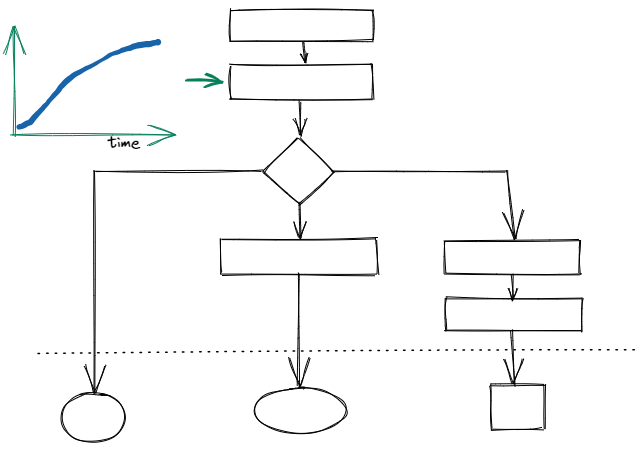
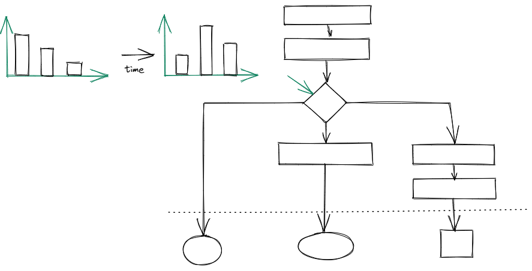

<p align="center">
    </a>
</p>

<h1 style="text-align: center;">
    
    StreamGen
</h1>

<p align="center">
a 🐍 framework for generating labeled data streams
</p>

<p align="center">
    
    <a href="https://www.repostatus.org/#wip"></a>
    
    
</p>

<p align="center">
    <a href="https://www.python.org/"></a>
    <a href="https://python-poetry.org/"></a>
</p>

<p align="center">
    <a href="https://github.com/astral-sh/ruff"></a>
    <a href="https://github.com/beartype/beartype"></a>
</p>

---

## 📃 Table of Contents

- [💡 Idea](#💡-idea)
- [📦 Installation](#📦-installation)
- [👀 Examples](#👀-examples)
- [📖 Documentation](#📖-documentation)
- [🙏 Acknowledgement](#🙏-acknowledgement)

---

## 💡 Idea







## 📦 Installation

```sh
pip install streamgen
```

## 👀 Examples

There are example notebooks 🪐📓 showcasing and explaining `streamgen` features:

+ 📈 time series
    + [🎲 sampling from static distributions](examples/time%20series%20classification/01_static_distributions.ipynb)
    + [🌌 creating data streams](examples/time%20series%20classification/02_data_streams.ipynb)
    + [📊 Data drift scenarios](examples/time%20series%20classification/03_drift_scenarios.ipynb)
+ 🖼️ analog wafer map streams based on the [wm811k dataset](https://www.kaggle.com/datasets/qingyi/wm811k-wafer-map) [^1] in [🌐 wafer map generation](examples/wafer_map_generation.ipynb)

## 📖 Documentation

Open the documentation by calling `poe docs`.

## 🙏 Acknowledgement

Made with ❤️ and ☕ by Laurenz Farthofer.

Special thanks to Benjamin Steinwender, Marius Birkenbach and Nikolaus Neugebauer for their valuable feedback.

I want to thank Infineon and Kai for letting me work on and publish this project.

Finally, I want to thank my university supervisors Thomas Pock and Marc Masana for their guidance.

---

## 📄 References

[^1]: Wu, Ming-Ju, Jyh-Shing R. Jang, and Jui-Long Chen. “Wafer Map Failure Pattern Recognition and Similarity Ranking for Large-Scale Data Sets.” IEEE Transactions on Semiconductor Manufacturing 28, no. 1 (February 2015): 1–12.
