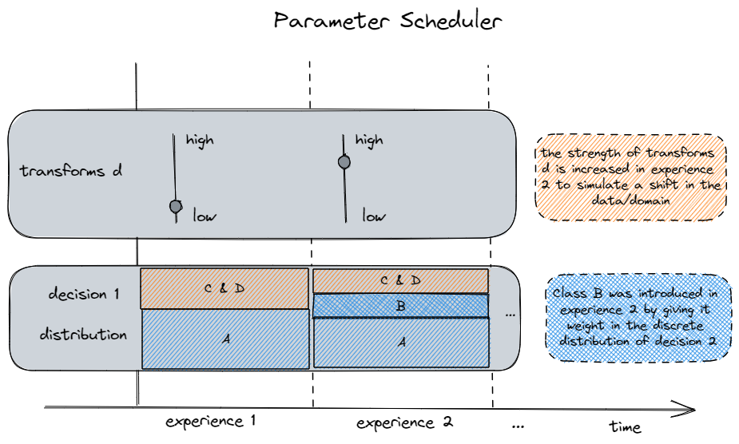

![A tree of sampling functions and transformations. Samples are generated by traversing the tree from the root to the leaves. Each path through the tree represents its own class-conditional distribution. Each branching point represents a categorical distribution which determines the path to take for a sample during the tree traversal. By changing the parameters of the transformations over time, such trees can represent evolving distribution suitable to generate data streams (see \autoref{fig:parameter_schedule}).\label{fig:sampling_tree}](images/sampling_tree.png){ width=95% }

# Summary

StreamGen is a framework for generating labeled, synthetic data streams from trees composed of sampling functions and transformations (see \autoref{fig:sampling_tree}).

Due to the expensive nature of the labelling process, researchers and machine learning practitioners often rely on existing datasets and stochastic data augmentation pipelines like `torchvision.transforms.Compose` objects in torchvision [@maintainers_torchvision_2016], which are not enough for newer research fields like Continual Learning. StreamGen addresses this limitation by giving researchers the tools to model time-dependent, diverse class-conditional distributions.

Such distributions can be represented through the use of a [tree](https://en.wikipedia.org/wiki/Tree_(data_structure)) (or other directed acyclic graph (DAG)) data structure to store sampling functions and transformations. Samples are generated by traversing the tree from the root to the leaves. Each branching point represents a categorical distribution which determines the path to take for a sample during the tree traversal.

Such a tree comprised of fixed transformations represents a static, class-conditional distribution. In order to extend the framework to evolving distributions (streams), either the **parameters** of the stochastic transformations or the **topology** of the tree needs to be changed over time (see \autoref{fig:parameter_schedule}). Due to the complexity of designing and reasoning about evolving topologies, StreamGen focuses on static tree topologies and only schedules the parameters of the transformations and the probabilities of the branching points.

Streamgen implements the following abstractions and utility functions to design data streams:

- Classes and functions to construct, schedule and visualize time-dependent parameters
- A selection of custom nodes based on [anytree](https://github.com/c0fec0de/anytree)'s `NodeMixin` [@c0fec0de_anytree_2016]
- A `SamplingTree` class with:
  - Pythonic short-hand construction via nested lists and dictionaries
  - Parameter scheduling and configuration of all transformations via a simple `update()` step
  - Multiple sampling strategies (stochastic traversal, stratified, pruned)
  - Visualizations using [graphviz](https://www.graphviz.org/) [@gansner_open_1997]
- Stream abstraction to use datasets created with StreamGen in CL frameworks like [avalanche](https://github.com/ContinualAI/avalanche) [@lomonaco_avalanche_2021] or [continuum](https://github.com/Continvvm/continuum) [@douillard_continuum_2021]

The documentation also contains different stream generation examples:

1. Multi-class time series with different data drifts (covariate, prior-probability and concept shift)
2. An analog version of the WM811k dataset [@wu_wafer_2015] with covariate shift for Domain Adaptation research
3. Multi-label multi-class streams
4. Continuous targets for regression tasks
5. Attribute-based targets for Zero-Shot Learning Research

{ width=95% }

# Statement of need

Most machine learning systems rely on *stationary, labeled, balanced and large-scale* datasets.
**Incremental learning** (IL), also referred to as **lifelong learning** (LL) or **continual learning** (CL), extends the traditional paradigm to work in dynamic and evolving environments [@masana_class-incremental_2022].
This requires such systems to acquire and preserve knowledge continually.

Existing CL frameworks like [avalanche](https://github.com/ContinualAI/avalanche) [@lomonaco_avalanche_2021] or [continuum](https://github.com/Continvvm/continuum) [@douillard_continuum_2021] construct data streams by *splitting* large datasets into multiple *experiences* (a scenario called Class-Incremental Learning), which has a few shortcomings:

- real data streams are rarely comprised of disjoint experiences
- such constructed scenarios often offer limited insight into factors of the stream other than the class distribution, which are required to study learning scenarios with fewer constraints on the stream properties like Domain Adaptation or Class-Incremental scenarios with repetition. Some researchers even argue that the dominance of CI scenarios has lead to several rather complex proposed methods, that completely fail in more realistic, unconstrained scenarios with repetition [@cossu_is_2021]
- the evaluation of continual learners on such scenarios is not trivial as evident by the wealth of proposals [@van_de_ven_continual_2024]

To answer different research questions in the field of CL, researchers need knowledge and control over a variety of factors of the underlying data distribution:

- class distributions
- novelties and outliers
- complexity and evolution of the background domain
- semantics of the unlabeled parts of a domain
- class dependencies
- class composition (for multi-label modelling)

A more economical alternative to collecting and labelling streams with desired properties is the **generation** of synthetic streams [@lu_learning_2018].
Some mentionable efforts in that direction include augmentation based dataset generation like [ImageNet-C](https://github.com/hendrycks/robustness) [@hendrycks_benchmarking_2019] or simulation-based approaches like the [EndlessCLSim](https://arxiv.org/abs/2106.02585) [@hess_procedural_2021], where semantically labeled street-view images are generated (and labeled) by a game engine, that procedurally generates the city environment and simulates drift by modifying parameters (like the weather and illumination conditions) over time.

StreamGen builds on these ideas and provides researchers with a general and intuitive framework to generate data streams without constraints on the stream characteristics and the full knowledge of underlying distributions. It will lay the foundation for more directed and efficient research on Continual Learning.

# Future work

The generation of multi-label samples requires loops and cycles for a compact and convenient representation. Such scenarios are still representable with tree data structures by unrolling these cycles through many redundant paths and transformations, but a representation using less restricted types of graphs presents an interesting future extension to the framework.

Streamgen already defined protocols and base classes to include different sampler concepts in the future.

More declarative ways to build schedules and distributions with special characteristic represent other promising extensions.

# Acknowledgements

This work was funded by the Austrian Research Promotion Agency (FFG, Project No. 905107).

Special thanks to Benjamin Steinwender, Marius Birkenbach and Nikolaus Neugebauer for their valuable feedback.

I  also want to thank Infineon and Kai for letting me publish this project.

Finally, I want to thank my university supervisors Thomas Pock and Marc Masana for their guidance.

# References
